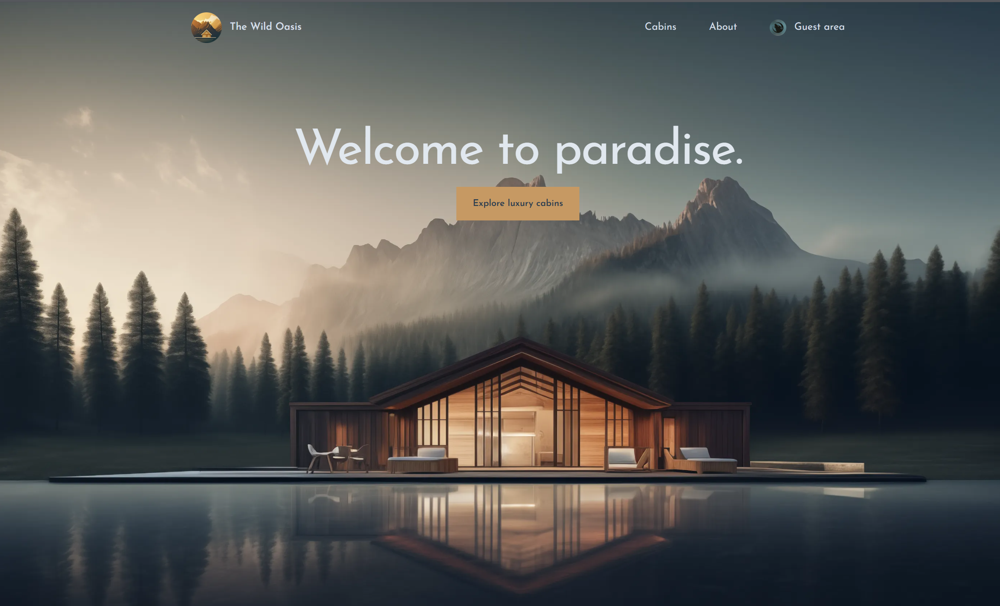
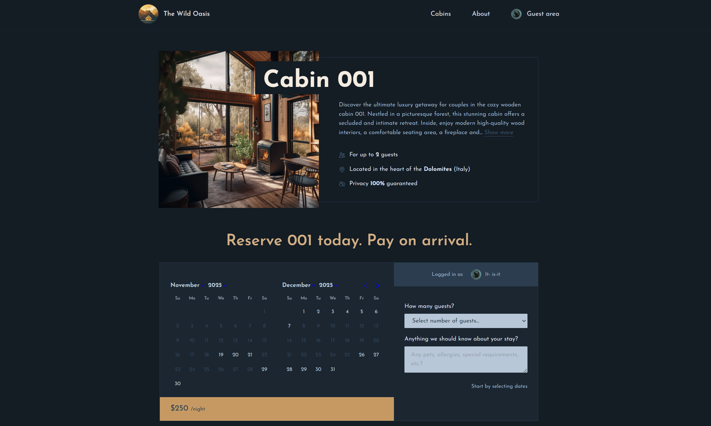
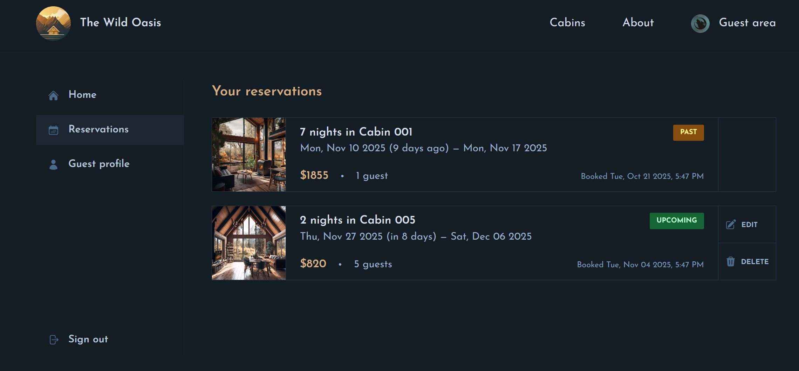
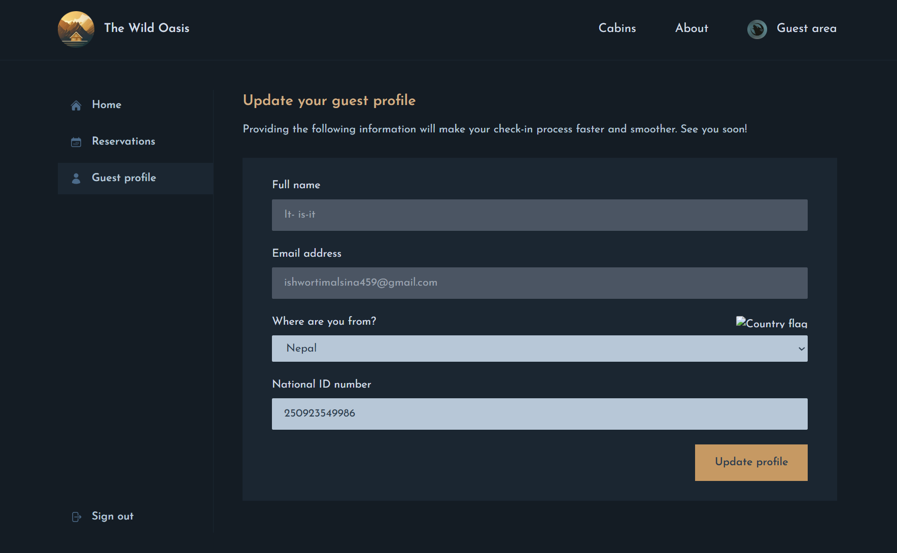
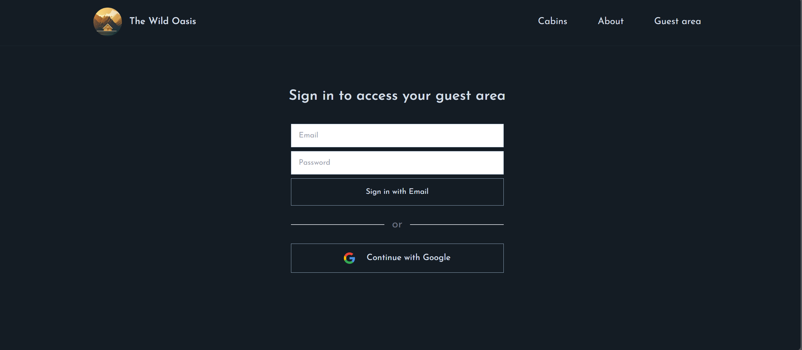
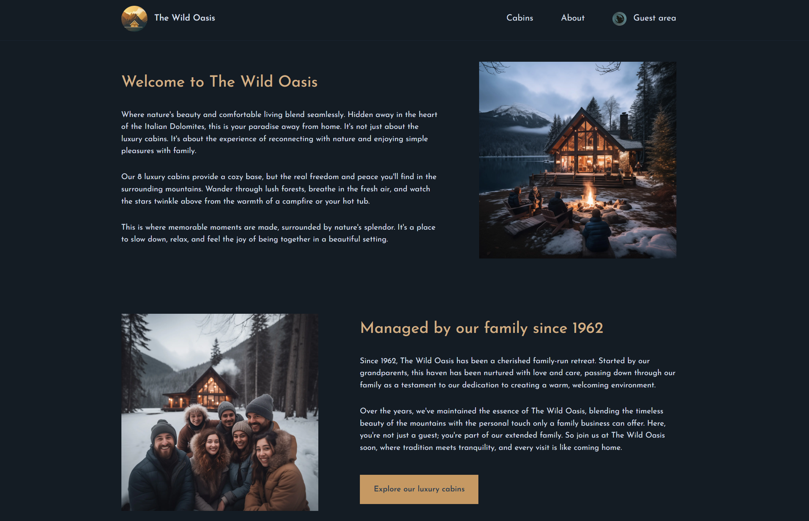

# 🌴 The Wild Oasis – Hotel Booking Website

**The Wild Oasis** is a modern, responsive hotel booking website that provides guests with a seamless experience for discovering and reserving cabins. Built with cutting-edge technologies, it offers intuitive booking flows, secure authentication, and beautiful UI components.

🔗 **Live Demo**: [https://the-wild-oasis-website-ishwor.vercel.app/](https://the-wild-oasis-website-ishwor.vercel.app/)
🧪 **Demo Login**: `test@test.com` / `test1234`

---

## 🧠 Motivation

> _"Creating delightful user experiences in the travel industry."_

This client-facing application was designed to complement the admin system, focusing on:

- 🎯 **User-Centric Design** – Intuitive booking process and cabin discovery
- ⚡ **Performance** – Fast loading with Next.js and optimized images
- 🔒 **Security** – Secure authentication and payment-ready structure
- 📱 **Responsiveness** – Flawless experience across all devices

---

## 📸 Screenshots

### 🏠 Homepage



### 🛏️ Cabin Listings


### 🔍 Cabin Details



### 📋 Reservation Process



### 👤 Guest Profile



### 🔐 Authentication



### 👤 Account Management


### ℹ️ About Page



---

## ✨ Key Features

### 🏠 Cabin Discovery

- Browse available cabins with high-quality images
- Filter by dates, capacity, and amenities
- Detailed cabin pages with full descriptions and galleries

### 📅 Smart Booking System

- Interactive date picker with availability checking
- Real-time price calculation with discounts
- Flexible booking options (nights, guests)

### 🔐 Secure Authentication

- Guest registration and login
- Profile management with booking history
- Secure session management

### 💰 Transparent Pricing

- Clear breakdown of costs (accommodation, breakfast, extras)
- Discount display and application
- No hidden fees

### 📱 Mobile-First Design

- Fully responsive across all device sizes
- Touch-friendly interface elements
- Optimized performance on mobile networks

### 🔔 Booking Management

- View upcoming and past stays
- Easy modification and cancellation
- Digital check-in information

---

## 💻 Tech Stack

**Frontend Framework**

- `Next.js 14` with App Router
- `React 18`
- `Tailwind CSS` for styling

**Authentication & Backend**

- `NextAuth v5` (beta) for authentication
- `Supabase` for database and real-time features

**UI & UX Components**

- `Heroicons` for beautiful icons
- `react-day-picker` for date selection
- `date-fns` for date manipulation

**Performance & Optimization**

- Next.js Image optimization
- Server-side rendering (SSR)
- Static generation where applicable

---

## 🛠️ Installation & Setup

### Prerequisites

- Node.js 18+ (LTS recommended)
- Supabase project with proper tables
- Environment variables configured

### 1. Clone the Repository

```bash
git clone https://github.com/it-is-it/the-wild-oasis-client-website.git
cd the-wild-oasis-
```

### 2. Install Dependencies

```bash
npm install
```

### 3. Environment Configuration

Create `.env.local` file:

```env
# Supabase
SUPABASE_URL=your_supabase_project_url
SUPABASE_KEY=your_supabase_anon_key

# NextAuth
NEXTAUTH_URL=http://localhost:3000
NEXTAUTH_SECRET=your_secure_secret_here

# Optional OAuth providers
# GOOGLE_CLIENT_ID=...
# GOOGLE_CLIENT_SECRET=...
```

### 4. Run Development Server

```bash
npm run dev
```

Visit: http://localhost:3000

---

## 🏗️ Project Structure

```
/app
├── _components/           # Reusable app components
├── _lib/                  # auth, actions, supabase client, data-service
├── _styles/               # Global styles
├── about/                 # About page
├── account/
│   ├── page.js            # Account landing
│   └── profile/page.js    # Profile management
├── api/                   # NextAuth handlers and APIs
├── cabins/
│   ├── page.js            # Cabin listings
│   └── [cabinId]/page.js  # Single cabin page
├── login/page.js          # Sign-in page (Google + Credentials)
├── layout.js              # Root layout
├── page.js                # Homepage
├── error.js               # Error boundary
├── loading.js             # Global loading UI
└── not-found.js           # 404 page
```

---

## 🎯 Core Pages & Routes

### `/` - Homepage

- Button for exploring cabins

### `/cabins` - Cabin Listings

- Filterable grid of all cabins
- Availability indicators

### `/cabins/[id]` - Cabin Details

- Full cabin information and photo
- Availability calendar
- Booking cabin buttons and form

### `/about` - About Wild Oasis

- History & details about wild oasis
- button for exploring cabins

### `/login` - Authentication

- Secure login
- Social auth options (Google)

### `/account` - User Account

- Welcome page
- Booking history & can edit
- update the guest profile
- sign out button

---

## 🔐 Authentication Flow

1. **Guest Access**

   - Browse cabins and view prices/availability without signing in
   - Details and calendar are available on each cabin page

2. **Sign-in to Reserve**

   - Sign in with Google or email/password to make a reservation
   - On first login, a guest profile is created; complete it under Account → Profile (e.g., nationality, ID)

3. **Account Management**
   - View and manage reservations (edit/cancel where allowed)
   - Update guest profile information
   - Sign out when done

---

## 📦 Available Scripts

```bash
npm run dev          # Start development server
npm run build        # Create production build
npm run start        # Start production server
npm run lint         # Run ESLint
npm run prod         # Build and start production
```

---

## 🚀 Deployment

### Vercel (Recommended)

1. Push code to GitHub
2. Connect repository to Vercel
3. Add environment variables in Vercel dashboard
4. Deploy automatically

---

## 🔧 Environment Variables

| Variable               | Description                  | Required |
| ---------------------- | ---------------------------- | -------- |
| `SUPABASE_URL`         | Your Supabase project URL    | Yes      |
| `SUPABASE_KEY`         | Supabase anon/public key     | Yes      |
| `NEXTAUTH_URL`         | Application base URL         | Yes      |
| `NEXTAUTH_SECRET`      | Encryption secret for tokens | Yes      |
| `GOOGLE_CLIENT_ID`     | For Google OAuth (optional)  | No       |
| `GOOGLE_CLIENT_SECRET` | For Google OAuth (optional)  | No       |

## 🔮 Future Enhancements

- [ ] **Payment Integration** – Stripe/PayPal support
- [ ] **Reviews & Ratings** – Guest feedback system
- [ ] **Wishlist Feature** – Save favorite cabins
- [ ] **Advanced Filters** – More search options
- [ ] **Email Notifications** – Booking confirmations
- [ ] **Multi-language Support** – International guests
- [ ] **PWA Features** – Offline capability

---

## 🐛 Known Issues

- Date picker may need timezone handling improvements
- Image optimization for very large galleries
- Mobile Safari specific styling considerations

---

## 👨‍💻 Author

**Ishwor Timalsina**

- GitHub: [@it-is-it](https://github.com/it-is-it)
- Portfolio: [ishwortimalsina.com.np](https://ishwortimalsina.com.np)
- LinkedIn: [Ishwor Timalsina](https://linkedin.com/in/ishwor-timalsina)

---

## 🙏 Acknowledgments

- Next.js team for the amazing framework
- Supabase for the excellent backend services
- Vercel for seamless deployment
- The open-source community for invaluable packages
- Jonas Schmedtmann and the Udemy course that inspired and guided this build

_The Wild Oasis – Where nature meets luxury comfort._ 🌲✨

---

## 🔗 Related Projects

Here are some other projects you might find useful or inspiring:

- 🏨 [The Wild Oasis Admin site](https://github.com/it-is-it/the-wild-oasis) — Hotel management dashboard with modern UI and real-time data handling.
- 🏨 [Ecommerce Website from Next.js](https://github.com/it-is-it/Ecommerce) — Full-stack eCommerce web application built with Next.js 15 (App Router), MongoDB, Stripe, and NextAuth.js. It includes both user and admin functionalities, secure payment processing, and a modern UI powered by Bootstrap and Tailwind.
- 🌍 [Worldwise](https://github.com/it-is-it/Worldwise) — Travel tracking app to mark places you’ve visited and plan new adventures.
